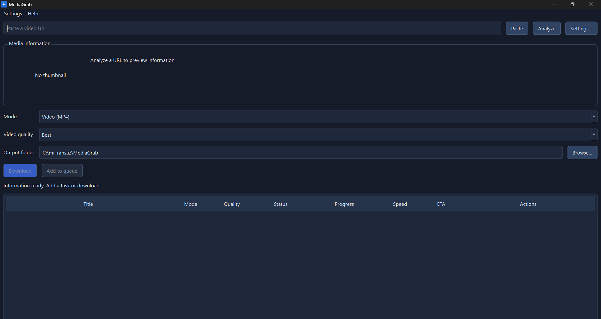
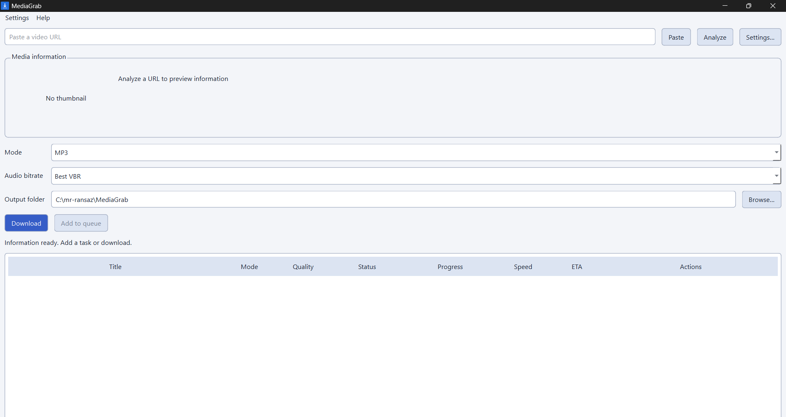
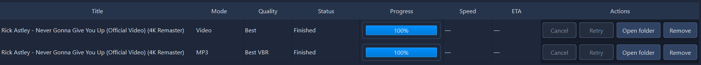
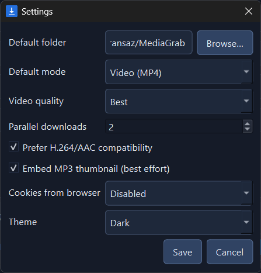
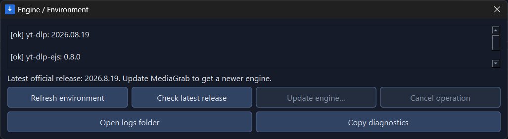
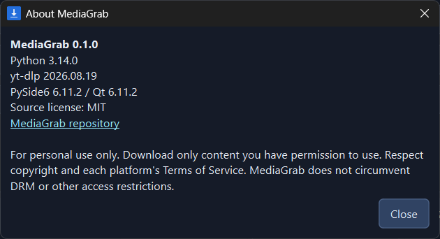
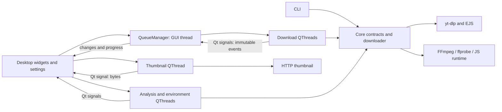

# MediaGrab

A Windows desktop and command-line media downloader with a reusable Python core, powered by yt-dlp, FFmpeg and PySide6.

[](https://github.com/mr-ransaz/MediaGrab/actions/workflows/ci.yml)
[](pyproject.toml)
[](LICENSE)

**Source-only: binaries are not currently distributed.** The maintainer will not publish a binary Release for now because the selected Gyan FFmpeg build is GPLv3 and includes libx264. Local build instructions remain available. The retained release workflow blocks publication without corresponding-source prerequisites.

## Features

- Analyze title, uploader, duration and available video heights, with an optional asynchronous thumbnail.
- Download MP4 or MP3. Compatibility mode prefers or converts to H.264/AAC; MP3 offers Best, 320, 192 and 128 kbps and optional artwork.
- Queue 1–4 simultaneous downloads (default 2), with progress, speed, ETA, cancellation, retry, removal and open-folder actions.
- Paste or drag URLs; save defaults and dark/light themes with QSettings.
- Inspect engine, FFmpeg/ffprobe, JavaScript and browser impersonation capabilities in background checks.
- Explicitly check engine releases and confirm virtual-environment updates; frozen engine updates are refused.
- First-run responsible-use acceptance, About information and rotating redacted logs.
- Local Windows x64 packaging with bundled FFmpeg/ffprobe/Deno and offline deployment checks.

Full playlists are a CLI opt-in. Queue contents are not persisted. Cancellation is cooperative; conversion can delay shutdown.

## Screenshots

These previews are labelled placeholders, not application captures. Replace them with the PNG files in the [screenshot checklist](docs/images/README.md), then update these image links.

| View | Placeholder | Required real file |
| --- | --- | --- |
| Dark interface and metadata |  | `docs/images/main-dark.png` |
| Light interface |  | `docs/images/main-light.png` |
| Active queue |  | `docs/images/download-queue.png` |
| Preferences |  | `docs/images/settings.png` |
| Engine and environment |  | `docs/images/engine-environment.png` |
| About and versions |  | `docs/images/about.png` |

## Quick start from source

Use Windows and **64-bit CPython 3.14**. Windows 10/11 are targets; frozen evidence is from Windows 11 and Windows 10 was not separately tested. From the repository root in PowerShell:

```powershell
python --version
python -m venv .venv
.\.venv\Scripts\python.exe -m pip install --editable ".[dev]"
.\.venv\Scripts\python.exe -m pip check
winget install Gyan.FFmpeg
winget install DenoLand.Deno
```

Installation requires internet access. Alternatively obtain FFmpeg/ffprobe from suppliers linked by the [FFmpeg download page](https://ffmpeg.org/download.html), and Deno from its [installation guide](https://docs.deno.com/runtime/getting_started/installation/). Put both FFmpeg executables in one folder on PATH. Restart PowerShell after installation or PATH changes, then verify and launch:

```powershell
ffmpeg -version
ffprobe -version
deno --version
.\.venv\Scripts\python.exe -m mediagrab.desktop.app
```

Python packages do not install these external executables. The yt-dlp default extra supplies EJS scripts. MediaGrab disables remote EJS fetching and configures discovered JavaScript runtime paths explicitly.

## GUI usage

1. Accept the responsible-use notice, paste a permitted HTTP/HTTPS URL and select **Analyze**.
2. Choose Video (MP4) or MP3, quality and destination. **Best** handles absent height metadata.
3. **Download** adds and starts the queue, including staged tasks. **Add to queue** stages work or joins an already running queue.
4. Use row actions for Cancel, Retry, Remove and Open folder. Active workers must exit before retry/removal.
5. Settings saves defaults for folder, format, parallelism, compatibility, artwork, browser cookies and theme. Existing tasks keep the settings captured when added.

Settings > Engine/Environment provides Refresh environment, Check latest release, Update engine, logs and Copy diagnostics. Updates require confirmation, an idle app and a virtual environment; restart after any install attempt. Help exposes About and the disclaimer. Closing waits for workers while showing **Stopping workers**.

## CLI usage

Replace `<media-url>` with a permitted HTTP/HTTPS URL. These commands perform downloads and are separate from offline tests:

```powershell
.\.venv\Scripts\python.exe -m mediagrab.core.cli --help
.\.venv\Scripts\python.exe -m mediagrab.core.cli "<media-url>" --height 1080 --output-dir ".\downloads"
.\.venv\Scripts\python.exe -m mediagrab.core.cli "<media-url>" --audio --bitrate 192
.\.venv\Scripts\python.exe -m mediagrab.core.cli "<media-url>" --playlists
.\.venv\Scripts\python.exe -m mediagrab.core.cli "<media-url>" --cookies-from-browser firefox --verbose
```

Height choices: best, 2160, 1440, 1080, 720, 480, 360. Bitrate choices: best, 320, 192, 128; Best means VBR quality 0, not guaranteed 320 kbps. Height is ignored in audio mode. Defaults save to `downloads/`, enable compatibility and attempt MP3 artwork. `--no-compatibility` keeps source codecs where MP4 supports them; `--no-thumbnail` disables artwork. Playlists default to entry 1 only. Ctrl+C cancels; exit codes are 0 (success), 1 (failure), 130 (cancellation).

## Supported sites

MediaGrab delegates extraction to yt-dlp and accepts sites it supports within MediaGrab's HTTP/HTTPS input and MP4/MP3 output constraints. Consult the upstream [supported sites list](https://github.com/yt-dlp/yt-dlp/blob/master/supportedsites.md). Support depends on the installed engine, platform changes, available formats and permitted account access; a listed site does not guarantee every URL works.

Login-required content, including Instagram, requires authorized access. Browser cookies are disabled by default; opt in through Settings or `--cookies-from-browser chrome`, `firefox` or `edge`. Loading can fail because of browser encryption or account permissions. Cookies do not bypass DRM, private-account permissions, age or geographic restrictions. `cookies.txt` import remains roadmap work.

## Architecture



Core imports no Qt or desktop code. Immutable requests/events cross the worker boundary; widgets and scheduling stay on the GUI thread. See [Architecture](docs/ARCHITECTURE.md) for contracts and trade-offs.

```text
src/mediagrab/core/         Models, validation, downloads, CLI, tools, updater
src/mediagrab/desktop/      Widgets, workers, queue, settings, logs, themes
src/mediagrab/resources.py  Source/frozen resource lookup
src/mediagrab/self_check.py Offline frozen capability checks
tests/                     Offline core/Qt tests; opt-in network test
scripts/                   Pinned tools, Windows build, frozen smoke
mediagrab.spec             PyInstaller configuration
docs/                      Architecture, development, build, history, evidence
.github/                   CI, guarded release workflow, contributor templates
```

## Tests and quality gates

```powershell
.\.venv\Scripts\python.exe -m ruff check .
.\.venv\Scripts\python.exe -m ruff format --check .
$env:QT_QPA_PLATFORM = "offscreen"
.\.venv\Scripts\python.exe -m pytest --basetemp=.pytest_tmp --cov=mediagrab.core --cov=mediagrab.desktop --cov-report=term-missing
```

Run pytest sequentially without the app running. Default tests are offline; network tests require explicit opt-in. Branch coverage retains the **80%** minimum. CI checks Python 3.14 on Windows and includes an advisory dependency audit. See [Development](docs/DEVELOPMENT.md), [Contributing](CONTRIBUTING.md), internal [phase history](docs/PHASES.md) and [verification notes](docs/NOTES.md).

## Local Windows package

On Windows x64 with Python 3.14:

```powershell
.\.venv\Scripts\python.exe -m pip install --editable ".[dev,build]"
.\scripts\build_windows.ps1
```

The script requires internet for pinned tools and runs frozen checks after building. Outputs include `dist/MediaGrab/MediaGrab.exe`, `dist/MediaGrab-0.1.0-windows-x64.zip` and its `.sha256` file. Extract the entire zip; preserve `_internal` and all tools. [Building](docs/BUILDING.md) covers self-checks, smoke, integrity and publication prerequisites.

The user verified clean-folder zip extraction, executable launch, bundled ffmpeg/ffprobe/deno detection and MP4/MP3 downloads on Windows. Windows 10 and live frozen Blender checks were not run. No binary Release is currently offered.

## Troubleshooting

| Problem | Action |
| --- | --- |
| FFmpeg not found | Install ffmpeg and ffprobe together, add their folder to PATH, restart and inspect Engine/Environment. A local frozen build needs both beside the exe. |
| JavaScript / YouTube solver warning | Install Deno, restart and refresh environment. Repair project dependencies with the same venv if EJS is missing. Minimum versions come from the installed engine. |
| Impersonation / TikTok failure | Inspect actual impersonation targets, repair using the editable install command and restart. Available targets do not guarantee platform access. |
| Instagram requires login | Log in normally with an authorized browser account, explicitly opt into its cookies and re-analyze. Never share cookies. |
| Unavailable quality | Re-analyze and select Best or an available height. Direct media can lack height metadata. |
| Slow conversion/cancellation | H.264/AAC conversion uses CPU and is lossy. Upstream operations stop at cancellation boundaries; allow shutdown to complete. |
| Update failed/cancelled | Run the same venv's `-m pip check`, repair with the editable install command and restart. Pip is not atomic. Frozen users rebuild MediaGrab locally. |
| Packaged startup failure | Re-extract the complete folder and use Building's self-check/smoke instructions. |
| Antivirus / SmartScreen | Local builds are unsigned. A warning alone does not establish a false positive. Verify provenance/hash, retain protection and submit suspected false positives to the vendor. |

Logs: `%LOCALAPPDATA%/MediaGrab/logs/mediagrab.log`, 2 MiB plus four backups. Prefer Copy diagnostics for reports and review for secrets. CLI `--verbose` adds redacted diagnostics.

## Privacy and security

Cookie access is opt-in. yt-dlp reads the selected browser session and uses it for requests; MediaGrab stores the preference, not cookie material. QSettings saves defaults and disclaimer acceptance, not the queue. Media/thumbnail requests contact chosen platforms. Explicit release checks and updates contact official GitHub/PyPI services; environment checks are offline.

Logs redact URLs, authentication material and user paths, retaining traceback basenames without source code or locals. Local self-check reports include paths. Input validation, output checks and shell-free subprocesses reduce risk; this tool is not a network sandbox and private hosts are allowed. See [Security](SECURITY.md).

## Responsible use

For personal use only. Download content only with permission. Respect copyright and platform Terms of Service. The authors do not encourage unauthorized downloads. MediaGrab implements no DRM circumvention; accepting the disclaimer does not grant rights-holder permission. Software is provided without warranty under its license.

## Roadmap

Planned, not implemented:

- macOS support and platform validation.
- Telegram bot reusing the Qt-independent core.
- Web app with server access and isolation controls.
- Optional `cookies.txt` import with explicit consent and secret handling.
- Optional frozen engine updates with staged verification and rollback.

## License and notices

Source is [MIT licensed](LICENSE). Dependencies retain their licenses; see [Third-party notices](THIRD_PARTY_NOTICES.md). Selected FFmpeg is GPLv3 (libx264); Qt uses the LGPLv3 option. Local builds preserve notices and replaceable components. Future binary publication requires reviewed complete corresponding source for distributed GPL/LGPL components; a link to FFmpeg alone is insufficient.
